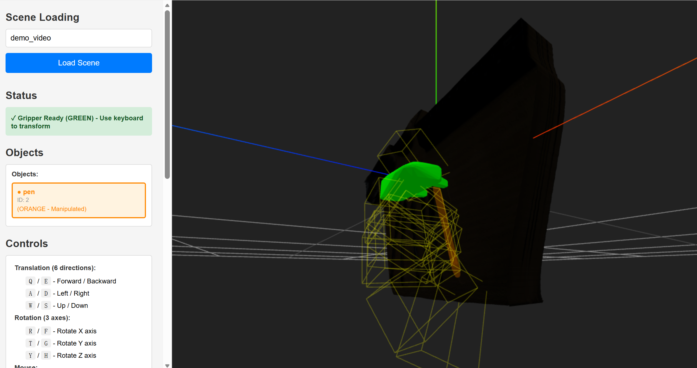

# User Guide

Our framework contains several stages:
- [Preprocess](../openreal2sim/preprocess/): collect or estimate depths and camera information from images and videos
- [Reconstruction](../openreal2sim/reconstruction/): build physically interactable scenes from images and videos
- [Motion](../openreal2sim/motion/): process trajectory and generate grasp poses
- [Simulation](../openreal2sim/simulation/): import physical scenes into the simulator, collect robotic demonstrations

### Before We Start

1. We will start with the provided examples in the `data/` folder. 

You can also prepare your own data following the same structure:
```
data/
    key_name.jpg or .png  # for single image input
    key_name.mp4          # for video input
    key_name.mp4 + key_name_depth.png # for video input with GT depths
```
and make sure the `key_name` is also in `config/config.yaml`.

2. Make sure we have pulled or built the docker images following the [docker setup](../docker/README.md).

We will use `openreal2sim:dev` image for the reconstruction and `isaaclab:dev` image for the IsaacLab simulation.

### Preprocess

Launch the docker container with mounted repository and data folder:
```
HOST_UID=$(id -u) HOST_GID=$(id -g) docker compose -p "$USER" -f docker/compose.yml run -p 8000:5000 openreal2sim
```

**Note**: We have mounted several volumes so that checkpoints will be cached even if the container is removed. You can change the volume mappings by modifying the `docker/compose.yml` file.

The following steps are all performed inside the docker container.

For the first-time use, **inside the docker container**, run the following script to download pretrained checkpoints and compile c++/cuda extensions:

```
python scripts/installation/install.py
```


Running this scripts for all preprocessing steps:
```
python openreal2sim/preprocess/preprocess_manager.py
```

This will provide estimated depths and camera intrinsics/extrinsics for the reconstruction stage. 

We can check the point cloud reconstruction quality at `outputs/{key_name}/geometry/dynamic_pcd.ply`:

<div style="text-align:center;">
  <video
    src="../data/demo_genvideo.mp4"
    controls
    muted
    playsinline
    loop
    style="width:45%; display:inline-block; vertical-align:top; margin-right:8px;"
  >
    Your browser does not support the video tag.
  </video>

  
</div>


### Reconstruction

We first need to segment objects that needs to be reconstructed. We provide a GUI for this purpose:
```
python openreal2sim/reconstruction/tools/segmentation_annotator.py
```


**How to use the GUI annotator:**

1. Input `key_name` (e.g. `demo_image`) in the `Output-key` textbox and press `load` to load image frames

2. Select the objects you want to segment by simply clicking on the image

3. Modify the object name from the default `pc_obj` to the class name in the `Point-click name` and press `Confirm mask` and `Save mask_dict`.

4. If you are processing a video, press the `PROPAGATE & SAVE` button to propagate the segmentation masks across frames.

**Please note that we must have a `ground` mask annotated, since we need this to find the ground plane for reconstruction.**

Example annotated masks are in `outputs/{key_name}/annotated_images`:
<p align="center">
  
  
  
</p>

Then, run the whole physical scene reconstruction pipeline:
```
python openreal2sim/reconstruction/recon_agent.py
```

We will get a portable scene assets folder at `outputs/{key_name}/simulation` and camera & scene information at `outputs/{key_name}/simulation/scene.json`.

We can check the mesh reconstruction quality at `outputs/{key_name}/simulation/scene_optimized.glb`:
<p align="center">
  
  
  
</p>

### Motion

First, please run the motion processing pipeline.

``python openreal2sim/motion/motion_manager.py``.


We also provide a GUI for grasp pose annotation. Please follow the instructions on the interface to annotate the grasping pose for selected scene.





Please run `python openreal2sim/motion/tool/gripper_pose_editor.py`. This will open the 5000 port of the container and the 8000 port of the server.

**How to use the GUI annotator:**

1. Input `key_name` (e.g. `demo_video`) in the blank textbox and press `Load Scene` to load image frames

2. Use the keyboard to move the gripper till a good pose.

3. Roll Down the left bar and press `Save Current Pose`.

4. You can press `Load Saved Grasps` to visualize all the saved grasps and delete them in the left bar if necessary.


### Robotic Simulation

We support importing the reconstructed scenes into different physics simulators and collecting robotic trajectories by cross-embodiment transfer from videos. Please refer to the [simulation](../openreal2sim/simulation/) part for more details.

Current supported physics simulators:

- [x] IssacLab ([IssacLab v2.0.2](https://isaac-sim.github.io/IsaacLab/v2.0.2/source/setup/ecosystem.html) & [IssacSim v4.5.0](https://docs.isaacsim.omniverse.nvidia.com/4.5.0/index.html))
- [x] Maniskills
- [ ] Mujoco [WIP]

#### IsaacLab Simulation:

If you want to use a pre-built image from Docker Hub, you can pull it directly:
```bash
docker pull ghcr.io/pointscoder/isaaclab:dev
docker tag ghcr.io/pointscoder/isaaclab:dev isaaclab:dev
```

**On the host machine and before entering the container**, run
```
xhost +local:
```
This is to allow the container to access the host's X server for IsaacSim GUI.

Then, launch the container:
```
HOST_UID=$(id -u) HOST_GID=$(id -g) docker compose -p "$USER" -f docker/compose.yml up -d isaaclab 
```
and enter it:
```
HOST_UID=$(id -u) HOST_GID=$(id -g) docker compose -p "$USER" -f docker/compose.yml exec isaaclab bash
```
We now have a bash script for usd conversion, heuristic manipulation rollout and randomized generation.

Please run

``bash simulation/isaaclab/demo/sim_agent.sh``

If you want to specify the stage, please add ``--stage `` parameter, and choose among ``usd_conversion``, ``sim_heuristic_manip`` and ``sim_randomize_rollout``.

The tunable params ares stored in ``simulation/isaaclab/demo/env/running_cfg.py``, please refer to that file for detailed instructions.

**Note**: when running the above script for the first time, it may take quite a while to load IsaacSim. Just be patient.


You may observe something like this in the IsaacSim GUI:

<div style="text-align:center;">
  <video
    src="../assets/isaaclab.mp4"
    controls
    muted
    playsinline
    loop
    style="width:75%; display:inline-block; vertical-align:top; margin-right:8px;"
  >
    Your browser does not support the video tag.
  </video>
</div>

<br><br>

and you can find the visuo-motor trajectories at `outputs/{key_name}/demos/`, as well as `h5py/{key_name}/`.


**Note**: The heuristic policy can be very un-stable, largely depending on the video object pose estimation quality. Please check the object pose estimation results at `outputs/{key_name}/reconstruction/objects/*.mp4`.

If the results are not good, a solution might be re-running the reconstruction stage from object pose estimation.
```
python openreal2sim/reconstruction/recon_agent.py --stage "scenario_fdpose_optimization"
```
by tuning the `fdpose_est_refine_iter` and `fdpose_track_refine_iter` in `config/config.yaml`.

You can also try selecting a new traj key. This requires going back to the motion stage and set the ``traj_key`` parameter in ``config.py``.